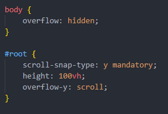
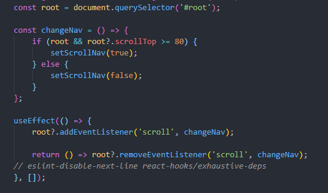

# Introduction

Ce projet fait référence à la vidéo suivante : [React Website using Styled Components and Smooth Scroll](https://www.youtube.com/watch?v=Nl54MJDR2p8).

Comme son nom l'indique, ce projet utilise Styled Components, ce qui est l'occasion de pratiquer cette bibliothèque.

De plus, ce projet utilise les Smooth Scroll. Sachant l'utiliser sur un site HTML/CSS, ce projet est l'occasion de découvrir comment cela est géré avec Réact.

Le projet n'étant pas un très gros projet, j'ai pris la décision de la faire avec le template Typescript.

# Difficultées rencontrées

Rien de surprenant, mes difficultés ont été au niveau de Typescript, même si il n'y avait que très peu de modifications à apporter par rapport au code de base. 

La première des difficultés était de réussir à passer des props à un Style Components sans avoir de message d'erreur.

Afin de réussir à passer des props au Styled Component, j'ai déclaré une interface Props afin de typer les propriétés reçues. Toutefois, dans le cas où il n'y ait qu'une propriété, l'utilisation d'une interface n'est pas utile. Bien que dans le cas actuel non plus, c'est surtout une question de comfort et d'élégance du code.

Cependant, pour les Styled Components d'Element JSX, cette méthode ne fonctionnait pas.

En utilisant une déclaration intermédiaire afin de partitionner les props, j'ai pu corriger le problème. Cela me permet d'envoyer seulement les props de Link à Link et de conserver les autres pour mon css.

Le site étant un site-one-page, j'ai voulu mettre en place la règle css scroll-snap qui permet que lorsque l'on est entre deux pages, le scroll fini le parcours jusqu'à la page suivante.

Hélas, cela n'a pas voulu fonctionner directement. Autant sur un site lambda c'est assez bateau, autant sur un site Réact, j'ai eu beaucoup plus de mal à savoir où placer mes règles css.

N'ayant pas réussit de prime-abord, j'ai testé de mettre cela en place à partir d'une librairie Fullpage, mais le résultat n'en a pas été différent.

Force de percévérer, je suis finalement parvenu à faire ce que je voulais.

Containeur : 

`root` étant le parent des différents éléments que je souhaite aimanter, il était logique de mettre les règles css du parent dessus. Afin de ne pas avoir 2 scrollbars, il ne faut pas oublier de rétirer le scrollbar de body.

Il ne restait plus qu'à ajouter `scroll-snap-align: start;` sur chaque enfant que je souhaitais aimanter, c'est-à-dire toutes les sections ainsi que le footer !

Le problème avec tout cela, c'est que la scrollbar n'était plus sur body, mais root, ce qui a eu pour effecter de rendre disfonctionnel ma navbar qui changer de couleur de fond en fonction de la position du ``scrollY`` de window.

De la sorte, mon event au scroll fonctionne à présent sur root et se base sur `element.scrollTop` plutôt que `window.scrollY`.

# Ce que m'a apporté ce projet

## Styled Components

Ce projet m'a aidé à pratique un peu plus les Styled Components. Il a aussi été l'occasion de revoir son avantage pour les réglès conditionnelles en css, qui sont très simple à mettre en place avec Styled Components. Sans ca, il faudrait passer par des classes en plus pour écraser la règle par défaut. Au moins ici, c'est clair et concis.

## Typescript

Finalement, je pensais que faire Réact en typescript allait apporter beaucoup de modifications, mais en fait non. A moins d'avoir pas tout faire. Ce projet a utilisé très très peu de fonctions/classes, donc il en a résulté qu'il y avait peu de choses à typer. La vraie découverte aura donc été le typage avec Styled Components.

## Scroll smooth & scroll snap

Ce projet aura aussi été l'occasion de gérer les events sur les scrolls, que cela soit par la douceur pour aller vers une ancre, que l'aimantation du scroll à certains éléments.