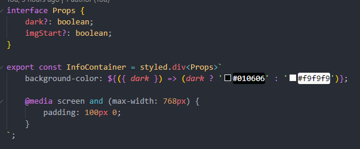
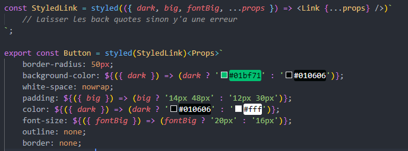

# Introduction

Ce projet fait référence à la vidéo suivante : [React Website using Styled Components and Smooth Scroll](https://www.youtube.com/watch?v=Nl54MJDR2p8).

Comme son nom l'indique, ce projet utilise Styled Components, ce qui est l'occasion de pratiquer cette bibliothèque.

De plus, ce projet utilise les Smooth Scroll. Sachant l'utiliser sur un site HTML/CSS, ce projet est l'occasion de découvrir comment cela est géré avec Réact.

Le projet n'étant pas un très gros projet, j'ai pris la décision de la faire avec le template Typescript.

# Difficultées rencontrées

Rien de surprenant, mes difficultés ont été au niveau de Typescript, même si il n'y avait que très peu de modifications à apporter par rapport au code de base. 

La première des difficultés était de réussir à passer des props à un Style Components sans avoir de message d'erreur.

Afin de réussir à passer des props au Styled Component, j'ai déclaré une interface Props afin de typer les propriétés reçues. Toutefois, dans le cas où il n'y ait qu'une propriété, l'utilisation d'une interface n'est pas utile. Bien que dans le cas actuel non plus, c'est surtout une question de comfort et d'élégance du code.

Cependant, pour les Styled Components d'Element JSX, cette méthode ne fonctionnait pas.

En utilisant une déclaration intermédiaire afin de partitionner les props, j'ai pu corriger le problème. Cela me permet d'envoyer seulement les props de Link à Link et de conserver les autres pour mon css.